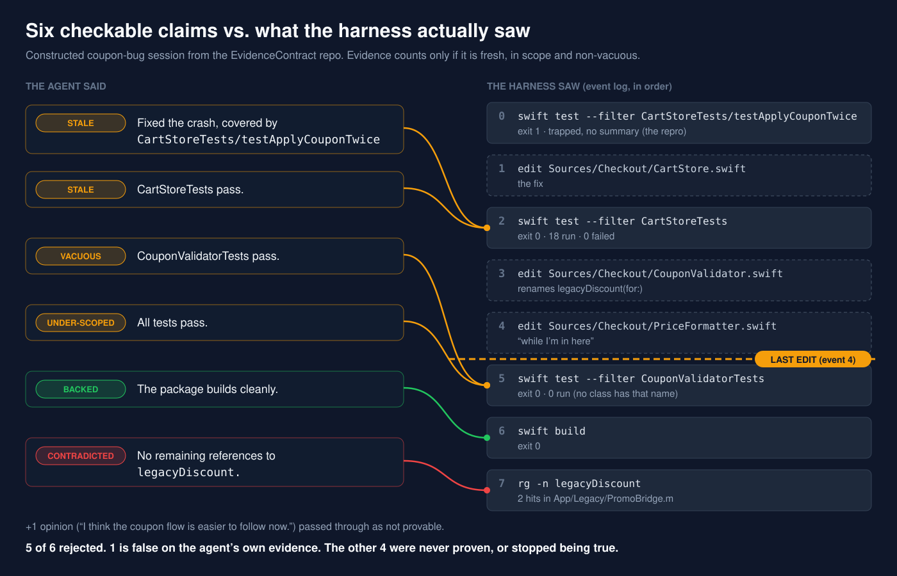

# EvidenceContract

**Never accept a claim from a coding agent that the agent could have proven with a tool call.**

A small Swift package that reads a coding agent's final report, pulls out the claims a tool could check ("all tests pass", "builds cleanly", "no remaining references to `legacyDiscount`", "fixed, covered by `CartStoreTests/testApplyCouponTwice`"), and checks each one against the harness's own log of what actually ran, in order.

Article: (added after publish)



## The rule that matters

A claim is only backed by a run that is:

- **from the harness**, not quoted in the agent's summary (`ContractEvaluator.evaluate(report:log:)` takes the two separately, and only the log can back anything),
- **fresh**: after the last edit, because a green run before an edit proves something about code that no longer exists,
- **in scope**: "all tests pass" needs a full-suite run, not `--filter CartStoreTests`,
- **non-vacuous**: `swift test --filter NoSuchTests` exits 0 having executed zero tests (verified on Swift 6.0.3; captured output is in the tests).

Regression claims need one more thing: a run showing the test **failing before the fix**. A test that never failed has not been shown to exercise the bug.

## Verdicts

| Verdict | Meaning | Accepted |
|---|---|---|
| backed | fresh, in-scope, successful run | yes |
| stale | the run predates the last edit | no |
| under-scoped | only a narrower run exists | no |
| vacuous | zero tests executed, or no summary line | no |
| contradicted | the agent's own evidence says otherwise | no |
| never failed | regression claim with no failing repro | no |
| unbacked | nothing checked it | no |
| not provable | opinion, taste, intent | passed through |

## Usage

```swift
import EvidenceContract

var log = SessionLog()
log.record(command: "swift test --filter CartStoreTests", output: capturedOutput, exitCode: 0)
log.recordEdit("Sources/Checkout/PriceFormatter.swift")

let report = ContractEvaluator().evaluate(report: agentFinalMessage, log: log)
if let reason = report.stopHookReason {
    // Claude Code Stop hook: print {"decision": "block", "reason": reason}
}
```

Each rejected claim comes with a next move phrased as a tool call, for example:

```text
2. "CartStoreTests pass." [stale] Re-run `swift test --filter CartStoreTests`. Your last run (event 2) predates your edit to Sources/Checkout/PriceFormatter.swift (event 4).
```

## The sample session

`SampleSession` is a **constructed** session, not a measurement: an agent fixing a crash when a coupon is applied twice. Its report makes seven claims; six are checkable. Against the first log: 1 backed, 2 stale, 1 vacuous, 1 under-scoped, 1 contradicted. After the Stop-hook feedback the agent runs four more commands and a revised report is fully backed. `SampleSessionTests` pins every one of those numbers.

## Known limits

- Claim extraction is deterministic pattern matching. It will miss phrasings it doesn't know; missed claims become `not provable`, never falsely backed.
- Coverage is by name. A green full-suite run backs "CouponValidatorTests pass" even if no class has that name (pinned in `testKnownLimitFullSuiteBacksAClaimAboutAClassThatDoesNotExist`).
- The parser understands `swift test`, `swift build`, `xcodebuild`, `rg` and `grep`. Turning your harness's transcript into `record(command:output:exitCode:)` calls is yours to write.

## How to run

```bash
git clone https://github.com/rajatslakhina/agent-evidence-contract-article-demo.git
cd agent-evidence-contract-article-demo
swift test
open Demo/Demo.xcodeproj   # pick an iOS 17+ Simulator, Build & Run
```

The Demo app consumes the package through a local package reference (`relativePath = ..`), so there is nothing else to fetch.

## Verification status

| Check | Result |
|---|---|
| `swift build` | passes (Swift 6.0.3, Linux aarch64) |
| `swift test` | 34 tests, 0 failures |
| `Demo.xcodeproj` | statically validated: balanced braces/parens, 20 objects all defined and referenced, parses as an OpenStep plist; shared scheme XML well-formed |
| Simulator run | **not done**. The app target has never been compiled. See `Demo/Screenshots/README.md`. |

MIT License.
